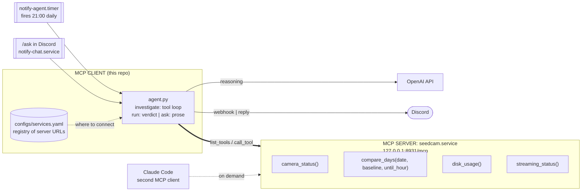

# AI-notification

A notification channel with an agent behind it. Services **subscribe** by running an MCP
server that answers questions about their own health. This repo runs the MCP
**client**: an agent that calls those tools, follows up on anything odd, correlates
across services, and reports. It reports two ways - one verdict a day on a timer, and an
answer whenever someone asks `/ask` in Discord.




| | Role | Tools | Lifetime |
|---|---|---|---|
| `agent.py` + registry | **MCP client** — picks tools, writes prose, computes nothing | none; it calls them | oneshot, fired by the timer |
| `chat.py` | The same client behind a Discord `/ask` command | none; it calls them | daemon, always connected |
| `seedcam.service` | **MCP server** in a daemon thread beside the camera loop | 4, inside the live process | always on |
| Claude Code | **MCP client**, read-only, via `.mcp.json` | none | interactive |

Tools always live **on the servers**, never in the hub. Adding a server adds tools the
agent can reach; the hub itself never grows. Servers bind `127.0.0.1` only, so
there is no auth to get wrong. Transport is MCP streamable HTTP, one short-lived session
per call.

## Subscribing a service

Serve MCP from the service, then add it to `configs/services.yaml`:

```yaml
services:
  my-service:
    url: http://127.0.0.1:8933/mcp
    description: What this service is, so the agent knows why it would call it
```

That is the whole subscription — nothing in `configs/agent.yaml` changes. See
`src/seedcam/mcp_server.py` in the seedcam repo for a reference server, and
[docs/CONFIG.md](docs/CONFIG.md) for tool design rules and every config key.

## Command line

```bash
uv run notify services                            # which servers answer, and their tools
uv run notify agent --no-post --show-transcript   # investigate, print every tool call
uv run notify agent                               # investigate and post to Discord
uv run notify chat                                # stay connected, answer /ask
uv run notify install configs/agent.yaml          # regenerate the systemd timer
```

## The Discord bot

ON-demand query

### Commands

| Command | Argument | What happens |
|---------|----------|--------------|
| `/ask` | `question` (required) | Investigates and replies in the channel. Public - everyone who can see the channel sees the answer. |
| `/data-check` | none | The same investigation, asking the fixed question in `chat.commands`: today's local files against yesterday, plus which cameras are live. |
| `/nas-check` | none | The last completed NAS sync, per target and site. The nightly run at 00:00 uploads the previous day, so this asks for yesterday - the most recent day fully accounted for. |
| `/ptz` | `action` (required), `camera` (optional) | Points one PTZ camera: nudges it, sends it to a preset, or just reads where it looks. The only command that moves anything. Leave `camera` out and it offers a menu of the PTZ cameras; give it and it accepts the `id` or the Korean site name, which the agent resolves against `camera_status`. |

`/ask` is the general form; the rest are routine commands worth a single word. A new one is
an entry under `chat.commands` in `configs/chat.yaml` - a `name`, a `description`, the
`prompt` that becomes the question, and optionally `args` - and nothing in the code.
Restart `notify-chat` and Discord picks it up.

Each entry under a command's `args` becomes a Discord argument, and `{name}` in the
prompt is replaced by what the operator typed. That is how an action addresses a target:
`/ptz` needs to know which camera.

An argument may instead be `optional` and carry `choices`, naming the tool that lists
what exists. Left out, the bot calls that tool and offers the answers as a menu, so an
operator who has never seen the fleet can still run the command without knowing an id.
`confirm` beside it names a tool to call for the chosen value and show before anything
runs - for `/ptz` that is `ptz_position`, so the button reads the camera's current
pan/tilt/zoom. The list and the preview are fetched in code: what exists is data, not a
judgement, and neither costs a model turn.

```
/ptz action: left
  🤖 Which camera?  [ NajuWanggok/cam2 · 나주왕곡  ▾ ]
  🤖 /ptz on NajuWanggok/cam2 - now at: {"pan": 0.47, "tilt": 0.61, "zoom": 1.0}
     [ Confirm ] [ Cancel ]
```

Only the operator who ran the command may work the menu or the buttons - the reply is
public, so otherwise a bystander could move a camera on someone else's command. Cancel
costs nothing: the model is never asked until Confirm is pressed. Discord caps a menu at
25 options, so `/ptz` filters to `type: ptz` (23 of the 30 cameras; the 7 fixed ones
cannot be pointed anyway) and says so plainly rather than truncating if the list ever
outgrows the cap.

`{yesterday}` in a prompt becomes a real date each time the command runs, because the
model has no clock. Dating it at startup instead would go stale: the daemon outlives the
day it was started on.

```
/ask check the NAS data
/ask check NAS data in Naju today
/ask is any camera offline right now?
/ask which cameras dropped compared to yesterday?

/ptz camera: NajuWanggok/cam2  action: left
/ptz camera: 나주왕곡 cam2        action: preset 3
/ptz camera: NajuWanggok/cam2  action: where is it pointing
/ask send 나주왕곡 cam2 back to its first preset
```

A move is not permanent: a scheduled scan or patrol takes the camera later and leaves it
wherever its own plan ends. Nothing restores the earlier view, so the agent reads
`ptz_position` before it moves and reports that position alongside the new one - that
report is the only record of where the camera was.

### Setup

1. Create an application at discord.com/developers, add a bot, copy its token.
   **Give the monitor an application of its own.** Two programs sharing one bot identity
   collide: Discord routes an interaction to whichever gateway session it picks, so
   commands land on the process that cannot serve them, and resetting the token for one
   program silently breaks the other.
2. Invite it with the `applications.commands` scope. No privileged intent is needed - a
   slash command carries its own text, so the bot never receives a message it was not
   addressed with.
3. Put `DISCORD_BOT_TOKEN` and `DISCORD_GUILD_ID` in the env file. `DISCORD_GUILD_ID`
   registers `/ask` in that one server, where it appears at once; without it registration
   is global and Discord may take an hour to publish it.
4. Install the unit:

```bash
sudo cp service/notify-chat.service /etc/systemd/system/
sudo systemctl daemon-reload && sudo systemctl enable --now notify-chat
```

### Running it

```bash
journalctl -u notify-chat -f          # one line per question
sudo systemctl restart notify-chat    # after changing the token or the instruction
```

```
connected as botman#7395, /ask, /data-check, /nas-check registered guild 1206993192386568283
/ask dangthanhvu.: 'check the NAS data' -> 2 calls, ok
/data-check dangthanhvu.: 'Report on the local recording volume today...' -> 3 calls, ok
```


