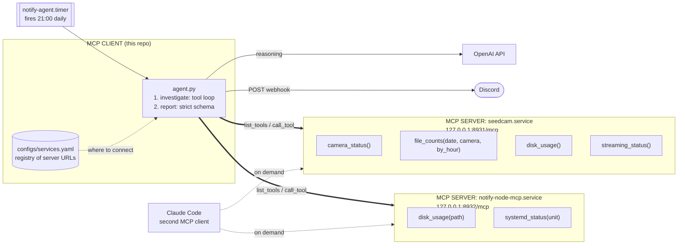

# AI-notification

A notification channel with an agent behind it. Services **subscribe** by running an MCP
server that answers questions about their own health. This repo runs the single MCP
**client**: an agent that calls those tools, follows up on anything odd, correlates
across services, and posts one verdict to Discord.




| | Role | Tools | Lifetime |
|---|---|---|---|
| `agent.py` + registry | **MCP client** — the only thing that notifies | none; it calls them | oneshot, fired by the timer |
| `seedcam.service` | **MCP server** in a daemon thread beside the camera loop | 4, inside the live process | always on |
| `notify-node-mcp.service` | **MCP server**, standalone daemon | 2, host-level | always on |
| Claude Code | **MCP client**, read-only, via `.mcp.json` | none | interactive |

Tools always live **on the servers**, never in the hub. Adding a server adds tools the
agent can reach; the hub itself never grows. Both servers bind `127.0.0.1` only, so
there is no auth to get wrong. Transport is MCP streamable HTTP, one short-lived session
per call.

## Subscribing a service

Serve MCP from the service, then add it to `configs/services.yaml`:

```yaml
services:
  my-service:
    url: http://127.0.0.1:8933/mcp
    description: What this service is, so the agent knows why it would call it
```

That is the whole subscription — nothing in `configs/agent.yaml` changes. See
`src/seedcam/mcp_server.py` in the seedcam repo for a reference server, and
[docs/CONFIG.md](docs/CONFIG.md) for tool design rules and every config key.

## Commands

```bash
uv run notify services                            # which servers answer, and their tools
uv run notify agent --no-post --show-transcript   # investigate, print every tool call
uv run notify agent                               # investigate and post to Discord
uv run notify install configs/agent.yaml          # regenerate the systemd timer
```


